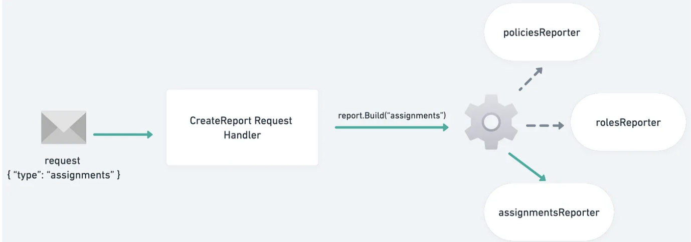
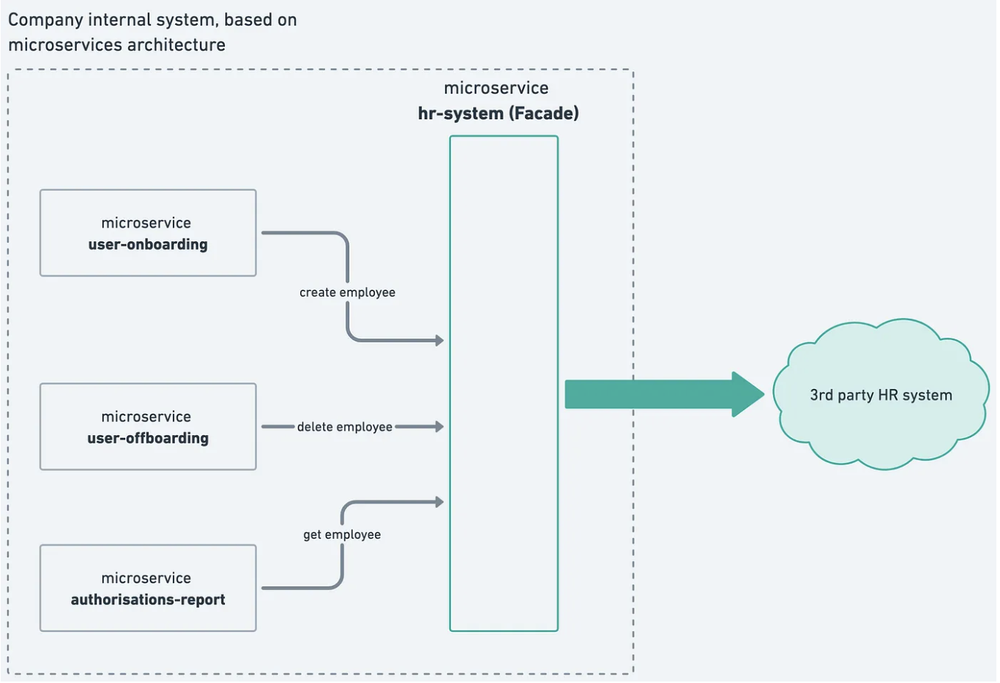

# Top 3 Design Patterns for a Large Go Codebase	

# Design Patterns that help to solve real problems

## Introduction

Design patterns are often considered to be fundamental knowledge every good software engineer should possess. Maybe it is true. However, not all theoretical knowledge is useful for day-to-day work.

I felt uncertain about the applicability of design patterns to my day-to-day work in a large microservice-based codebase, servicing millions of users. So I decided to investigate.

I don’t aim to describe all classical software design patterns. I concentrate on the top 3 design patterns, the usage of which I notice regularly. I’ll explain what particular real-world problem each of these patterns solves.

## A very brief history of design patterns

Let’s refresh our knowledge of how software engineering design patterns came about. In 1994, four authors — Erich Gamma, John Vlissides, Ralph Johnson, and Richard Helm published a book “[Design Patterns: Elements of Reusable Object-Oriented Software](https://www.oreilly.com/library/view/design-patterns-elements/0201633612/)”. This book earned the nickname “The Book by the Gang of Four,” later abbreviated to “the GoF book”.

The GoF book contained 23 patterns categorized into three groups: Creational, Structural and Behavioural patterns. The examples for the book were written in C++ and Smalltalk. As could be expected, the described patterns were influenced by these specific languages and by software engineering needs of the time. However, the concept of patterns proved to be enduring.

Today, we still refer to these 23 patterns grouped into three categories as the classic software design patterns. Example implementations for all these patterns are written in all the popular languages, including [an implementation in Go](https://golangbyexample.com/strategy-design-pattern-golang/). The latest is of particular interest to me since I mostly work with Go myself.

## Why use design patterns?

So design patterns exist, but why use them? They help engineers avoid reinventing the wheel when tackling commonly known or repetitively recurring problems. Additionally, design patterns help to communicate ideas between software engineers efficiently.

Knowledge of patterns may help engineers in the process of getting accustomed to an unfamiliar codebase too. The codebase, no matter its size, becomes less overwhelming if what happens in it can be mind-mapped with something familiar and universal. Design patterns provide frameworks for such mapping.

## Strategy: A plan for clarity and readability

> “Strategy: a plan that is intended to achieve a particular purpose”
> *Cambridge dictionary*

In software engineering, Strategy is a behavioural design pattern that allows objects to have a set of interchangeable behaviours and the ability to choose one of them at runtime according to the current needs.

The typical use-case for a Strategy pattern is an endpoint request handler. The handler’s behaviour must differ according to the request parameters, yet the complexity does not warrant separate endpoints for each case.

Let’s consider a microservice called **authorisations-report** as an example. It has a single endpoint */get-report*, which generates well a report. Different types of reports can be requested, such as authorisation roles, authorisation policies or assignments (connections between users and their authorisations).



Strategy design pattern diagram

The code for this example divided between two packages — *handler* and *report*. handler function *GetReport* calls Build method exposed by the report package and passes to it a requested report type. The report type can be either “roles”, “policies” or “assignments”.

```go
package "handler"

func (h *Handler) GetReport(ctx context.Context, body *reportproto.GetReportRequest) (*reportproto.GetReportResponse, error) {
 // Generate report
 result, err := report.Build(ctx, body.ReportType)
 if err != nil {
  return nil, error
 }

 return &reportproto.ReportResponse{report: result}, nil
}
```

And there is a *report* package. When *Build* functions is called, it selects a strategy for report building based on the type provided.

```go
package "report"

func Build(ctx context.Context, reportType string) (Report, error) {
 // We choose strategy to build report
 var reportBuilder reporter
 switch reportType {
 case constants.ReportTypeUsers:
  reportBuilder = allUsersReporter{}
 case constants.ReportTypeRoles:
  reportBuilder = roleReporter{}
 case constants.ReportTypePolicies:
  reportBuilder = policyReporter{}
 default:
  return nil, fmt.Errorf("invalid_report_type: Invalid report type provided")
 }

 report, err := reportBuilder.build(ctx, w)

 return report, err
}
```

The Strategy pattern is a simple and clean way to create different behaviours without overloading the code with numerous if/else conditions, thereby maintaining clarity and readability.

## Facade: a way of communication with 3rd-party service providers.

> “Facade (false appearance): a false appearance that makes someone or something seem more pleasant or better than they really are”
> Cambridge dictionary

In software engineering, by using a facade, we can hide an inner complexity of an actual entity implementation behind a simplified outer interface, which exposes only methods needed by the external system. This provides a simple and user-friendly interface to communicate with.

In microservices-based architecture, I saw this pattern being used many times for communication with 3rd party services. For example, DocuSign for managing documents or GreenHouse to assist with recruiting. Each facade is an autonomous microservice that bridges internal company services and external 3rd party API. This offers the flexibility to construct generic integrations that can be scaled up and down, monitored like any internal service, etc. I’ll look at microservice **hr-system** as an example of the facade.



Facade design pattern diagram

The code example demonstrates one endpoint handler *ReadEmployee*, responsible for getting employee by ID from external HR system using client.GetEmployee. The employee data is then transformed into a protobuf object shape using *marshaling.EmployeeToProto*, before being returned to the requester.

```go
package handler

func (h *Handler) ReadEmployee(ctx context.Context, body *hrsystemproto.GETReadEmployeeRequest) (*hrsystemproto.GETReadEmployeeResponse, error) {
 if body.EmployeeId == "" {
  return nil, validation.ErrMissingParam("employee_id")
 }

 // client is based on Go net/http package and does request to 3rd party system
 employee, err := client.GetEmployee(ctx, body.EmployeeId)
 if err != nil {
  return nil, fmt.Errorf("failed to read employee")
 }

 marshalled, err := marshaling.EmployeeToProto(ctx, employee)
 if err != nil {
  return nil, fmt.Errorf("failed to marshal employee")
 }
 return &hrsystemproto.GETReadEmployeeResponse{
  Employee: marshalled,
 }, nil
}
```

The use of facades provides a few benefits. Engineers are offered a limited subset of strongly-typed endpoints, where intricacies associated with request authentication, optional parameters, or object transformation are already addressed.

When the need in onboarding new 3rd party integration arises, to build it is becomes a quick and easy task because comprehensive blueprint for doing so already exists.

## Fan-out/Fan-in: Leveraging concurrency for getting results faster

> “Fan-out: to spread out over a wide area”
> *The Cambridge dictionary*.

This design pattern belongs to the concurrency patterns group and is outside of the The GoF book. However, the pattern is ubiquitous in distributed systems. Hence I want to discuss it.

The concept of this pattern is to divide a data retrieval task into multiple chunks, execute them concurrently, and then aggregate the results.

An array of items, where each item should be processed somehow, is a simple but realistic example. Imagine that the array is very large or processing of items takes a long time (For example, every item produces/requires an HTTP call).


Fan-in/Fan-out design pattern diagram

I will look at microservice **authorisations-report** as an example of the use of the Fan-in/Fan-out pattern. We already discussed this service in Strategy design pattern section. Noting prevents the service from implementing more than one design pattern at once.

Let’s say that the service received a request to produce an “assignments” report. In this service domain, assignment means a connection between company employee and authorisations granted to this employee. And assignments report is expected to provide information about all company employees and all authorisations currently granted to them.

Creation of such a report requires a lot of network requests, and doing it sequentially, on employee after employee basis, took around 30 minutes to complete.

Fan-out/Fan-in pattern comes to the rescue. It’s worth noting that in snipped of code, we do not spawn a Goroutine per employee since it would create more than one thousands goroutines and unhealthy spike in requests for all downstream services. We use a semaphore to limit our fanning-out width to 100 goroutines.

```go
func createReportRows(ctx context.Context, employeeProfiles []profile) (map[string]reportRow, error) {
 numOfEmployees := len(employeeProfiles)
 rowsChan := make(chan reportRow, numOfEmployees)
 concurrencyLimiter := semaphore.NewWeighted(100)

 // Fan-out stage, create rows of assignment report concurrenty
 for _, employee := range employeeProfiles {
  // Acquire a "token" from semaphore, block if none available.
  if err := concurrencyLimiter.Acquire(ctx, 1); err != nil {
   return nil, err
  }

  go func(curProfile profile, rowsChan chan<- reportRow, concurrencyLimiter <-chan struct{}) {
   // Release the "token" back to semaphore
   defer concurrencyLimiter.Release(1)

   rowsChan <- newRow(ctx, curProfile)
  }(employee, rowsChan, concurrencyLimiter)
 }

 // Fan-in stage, all created rows go into one data structure
 // As we know the exact number of rows, we can use a simple for loop
 // and wait for all of them to be created and sent to the channel.
 rows := make(map[string]reportRow, numOfEmployees)
 for i := 0; i < numOfEmployees; i++ {
  assignment := <-rowsChan
  rows[assignment.id] = assignment
 }

 return rows, nil
}
```

Fan-out/Fan-in is one of the most useful and ubiquitous patterns in a modern software engineering landscape because processing things one by one is just not enough.

## Recap of Discussed Design Patterns

The demonstrated use of design patterns proves that these patterns are more than theoretical constructs. They are integral to a production codebase and help maintain high coding standards by reapplying established effective patterns for solving recurrent problems.

In addition to classical design patterns, concurrency patterns have become a vital part of contemporary software development. I quickly looked at this group of patterns with the widely used Fan-out/Fan-in pattern.

That’s my take on design patterns that can be applied to software engineers’ day-to-day work. I’ve explored the top 3 from my experience, but the exploration doesn’t stop there. Design Patterns have evolved beyond the original 23 from The GoF, and beyond the addition of concurrency patterns. There are architectural patterns, messaging patterns, and so much more to explore!